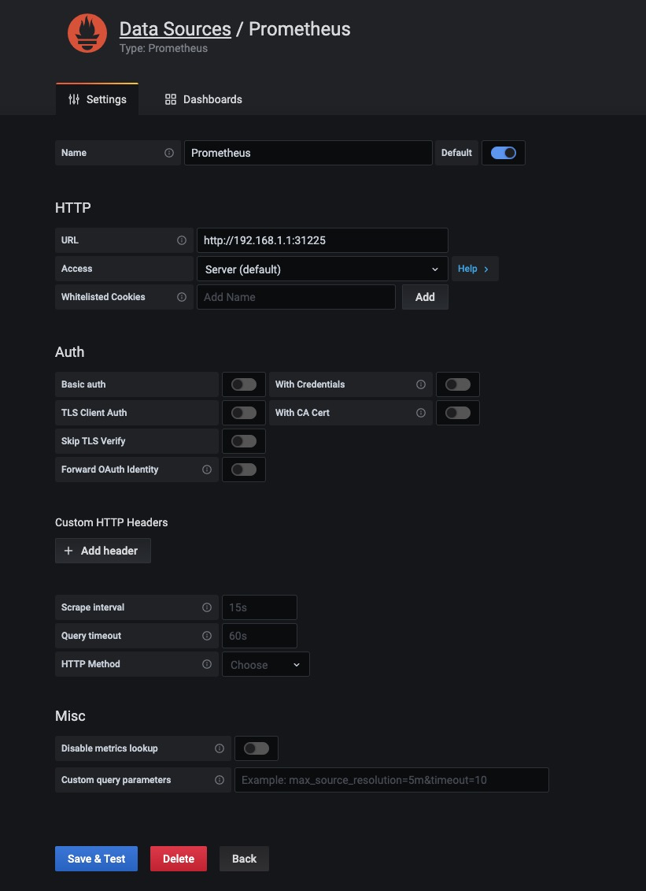
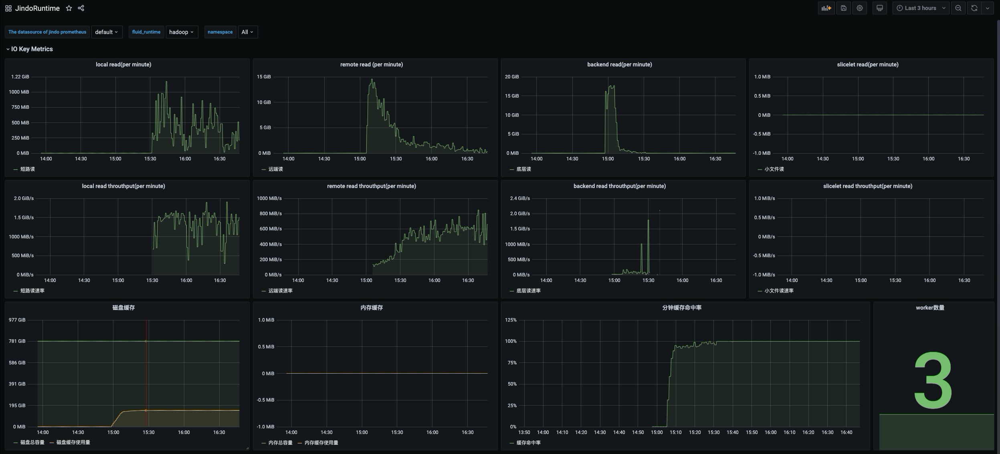

## 监控和可观测性功能

本文介绍在启动 Fluid JindoRuntime 的前提下，通过 Prometheus + Grafana 收集缓存系统相关的 metrics 指标，进行可视化展示的使用方法。

### 使用 In-Cluster 模式部署 prometheus 和 grafana 监控 Fluid 应用

#### 1. 部署或配置 Prometheus

如果集群内无 prometheus，请点击下载 [prometheus-jindofs.yaml](http://smartdata-binary.oss-cn-shanghai.aliyuncs.com/fluid/370/prometheus-jindofs.yaml) 文件

```shell
$ kubectl apply -f prometheus-jindofs.yaml
```

如集群内有 prometheus,可将以下配置写到 prometheus 配置文件中:

```yaml
scrape_configs:
- job_name: 'jindo runtime'
  metrics_path: /metrics/prometheus
  kubernetes_sd_configs:
    - role: endpoints
  relabel_configs:
  - source_labels: [__meta_kubernetes_service_label_role]
    regex: jindofs-master
    action: keep
  - source_labels: [__meta_kubernetes_endpoint_port_name]
    regex: rpc
    action: keep
  - source_labels: [__meta_kubernetes_namespace]
    target_label: namespace
    replacement: $1
    action: replace
  - source_labels: [__meta_kubernetes_service_label_release]
    target_label: fluid_runtime
    replacement: $1
    action: replace
  - source_labels: [__meta_kubernetes_endpoint_address_target_name]
    target_label: pod
    replacement: $1
    action: replace
```

#### 2. 部署 grafana

如果集群内无 grafana，请点击下载 [grafana.yaml](http://smartdata-binary.oss-cn-shanghai.aliyuncs.com/fluid/370/grafana.yaml) 文件

```shell
$ kubectl apply -f grafana.yaml 
```


#### 3. 配置 grafana

1. 登录 grafana
找到 grafana 服务所在的节点和改节点对外可访问 `grafana-node-ip`，如果想要在公网访问，可以绑定公网IP，

```shell
$ kubectl get pod -n kube-system -o wide | grep grafana 
monitoring-grafana-7dfcf6d5cd-5k8qw   1/1    Running  0   108m   10.54.1.11       cn-shanghai.192.168.1.1   <none>           <none>
```

找到 grafana 服务对应的 NodePort

```shell
$ kubectl describe svc monitoring-grafana -n kube-system
Name:                     monitoring-grafana
Namespace:                kube-system
Labels:                   <none>
Annotations:              <none>
Selector:                 app=grafana
Type:                     NodePort
IP Families:              <none>
IP:                       172.16.83.188
IPs:                      172.16.83.188
Port:                     <unset>  80/TCP
TargetPort:               3000/TCP
NodePort:                 <unset>  30396/TCP
Endpoints:                10.54.1.75:3000
Session Affinity:         None
External Traffic Policy:  Cluster
Events:                   <none>
```
可以看到当前暴露的 NodePort 为 `30396`

访问`http://$grafana-node-ip:NodePort`，默认账号密码 `admin:admin`

2. 查看 prometheus svc 端口

同样先找到 prometheus 服务所在的节点，找到该节点的 IP
```shell
$ kubectl get pod -n kube-system -o wide | grep grafana 
prometheus-deployment-d6d8554b4-wfl98    1/1     Running   0    17d   10.54.1.204    cn-shanghai.192.168.1.1   <none>    <none>
kubectl get no cn-shanghai.192.168.31.107 -o wide
NAME                     STATUS     ROLES    AGE     VERSION           INTERNAL-IP    EXTERNAL-IP 
cn-shanghai.192.168.1.1   Ready    <none>   5h51m   v1.20.4-aliyun.1   192.168.1.1   101.132.66.11
```
通过查看节点的`INTERNAL-IP`，可了解该节点的内部访问 IP 为 `192.168.1.1`


```shell
$ kubectl get svc -n kube-system | grep prometheus-svc
prometheus-svc             NodePort    10.100.0.144   <none>        9090:31225/TCP           22h
$ kubectl describe svc prometheus-svc -n kube-system
Name:                     prometheus-svc
Namespace:                kube-system
Labels:                   kubernetes.io/name=Prometheus
                          name=prometheus-svc
Annotations:              kubectl.kubernetes.io/last-applied-configuration:
                            {"apiVersion":"v1","kind":"Service","metadata":{"annotations":{},"labels":{"kubernetes.io/name":"Prometheus","name":"prometheus-svc"},"nam...
Selector:                 app=prometheus
Type:                     NodePort
IP:                       10.100.0.144
Port:                     prometheus  9090/TCP
TargetPort:               9090/TCP
NodePort:                 prometheus  31225/TCP
Endpoints:                10.99.224.138:9090
Session Affinity:         None
External Traffic Policy:  Cluster
Events:                   <none>
```
可以看到当前 prometheus svc 暴露的端口是 `31225`，后续使用 `http://IP:NodePort` 的形式来发现 prometheus 服务


3. 配置 prometheus data source
   
使用 `http://IP:NodePort` 的形式来发现 prometheus 服务




导入完成后点击Save & Test 显示 Data source is working 即可


4. 导入模板文件
   
grafana 选择导入模板 Json 文件，点击此处下载[fluid-prometheus-grafana-monitor-jindofs.json](http://smartdata-binary.oss-cn-shanghai.aliyuncs.com/fluid/370/fluid-prometheus-grafana-monitor-jindofs.json)

5. 查看监控

在 DashBoards 中找到导入的模版视图



注：fluid_runtime 对应Fluid runtime name; namespace 对应 Fluid runtime namespace


### JindoRuntime Prometheus 指标预览(更新中)
下面对 JindoRuntime 当前收集的指标进行预览和描述，您可以基于已收集指标在 Grafana 中进行组合和图表展示，如您需要额外的基本 metrics 展示，请开 issue 联系我们
```yaml
# HELP jindofsx_ns_backend_read_bytes_time_total_window
# TYPE jindofsx_ns_backend_read_bytes_time_total_window gauge
jindofsx_ns_backend_read_bytes_time_total_window 20367553  #一分钟内底层读取总数据量大小所用时间大小，单位微秒
# HELP jindofsx_ns_backend_read_bytes_total
# TYPE jindofsx_ns_backend_read_bytes_total gauge
jindofsx_ns_backend_read_bytes_total 166703347021 #总底层读取数据量大小，单位Byte
# HELP jindofsx_ns_backend_read_bytes_total_window
# TYPE jindofsx_ns_backend_read_bytes_total_window gauge
jindofsx_ns_backend_read_bytes_total_window 1174671374 #一分钟内底层读取总数据量大小，单位Byte
# HELP jindofsx_ns_backend_read_time_total
# TYPE jindofsx_ns_backend_read_time_total gauge
jindofsx_ns_backend_read_time_total 8717632094 #底层读取数据所用总时间大小，单位微秒
# HELP jindofsx_ns_backend_readop_num_total
# TYPE jindofsx_ns_backend_readop_num_total gauge
jindofsx_ns_backend_readop_num_total 181951 #底层总读取数据次数，对应 JindoFS 中 Block 个数
# HELP jindofsx_ns_local_read_bytes_time_total_window
# TYPE jindofsx_ns_local_read_bytes_time_total_window gauge
jindofsx_ns_local_read_bytes_time_total_window 0 #一分钟内短路读时间大小，单位微秒
# HELP jindofsx_ns_local_read_bytes_total
# TYPE jindofsx_ns_local_read_bytes_total gauge
jindofsx_ns_local_read_bytes_total 0  #总短路读取数据量大小，单位Byte
# HELP jindofsx_ns_local_read_bytes_total_window
# TYPE jindofsx_ns_local_read_bytes_total_window gauge
jindofsx_ns_local_read_bytes_total_window 0 #一分钟内短路读所用时间大小，单位微秒
# HELP jindofsx_ns_local_read_time_total
# TYPE jindofsx_ns_local_read_time_total gauge
jindofsx_ns_local_read_time_total 0 #短路读取数据所用总时间大小，单位微秒
# HELP jindofsx_ns_local_readop_num_total
# TYPE jindofsx_ns_local_readop_num_total gauge
jindofsx_ns_local_readop_num_total 0 #短路读总读取数据次数，对应 JindoFS 中 Block 个数
# HELP jindofsx_ns_remote_read_bytes_time_total_window
# TYPE jindofsx_ns_remote_read_bytes_time_total_window gauge
jindofsx_ns_remote_read_bytes_time_total_window 73714663 #一分钟内远端读所用时间大小，单位微秒
# HELP jindofsx_ns_remote_read_bytes_total
# TYPE jindofsx_ns_remote_read_bytes_total gauge
jindofsx_ns_remote_read_bytes_total 112108045498 #总远端读取数据量大小，单位Byte
# HELP jindofsx_ns_remote_read_bytes_total_window
# TYPE jindofsx_ns_remote_read_bytes_total_window gauge
jindofsx_ns_remote_read_bytes_total_window 13380884043 #一分钟内远端读取总数据量大小，单位Byte
# HELP jindofsx_ns_remote_read_time_total
# TYPE jindofsx_ns_remote_read_time_total gauge
jindofsx_ns_remote_read_time_total 765272359 #总远端读取时间，单位微秒
# HELP jindofsx_ns_remote_readop_num_total
# TYPE jindofsx_ns_remote_readop_num_total gauge
jindofsx_ns_remote_readop_num_total 107314 #远端读总读取数据次数，对应 JindoFS 中 Block 个数
# HELP jindofsx_ns_slicelet_read_bytes_time_total_window
# TYPE jindofsx_ns_slicelet_read_bytes_time_total_window gauge
jindofsx_ns_slicelet_read_bytes_time_total_window 0 #一分钟内小文件读所用时间大小，单位微秒
# HELP jindofsx_ns_slicelet_read_bytes_total
# TYPE jindofsx_ns_slicelet_read_bytes_total gauge
jindofsx_ns_slicelet_read_bytes_total 0 #总小文件读取数据量大小，单位Byte
# HELP jindofsx_ns_slicelet_read_bytes_total_window
# TYPE jindofsx_ns_slicelet_read_bytes_total_window gauge
jindofsx_ns_slicelet_read_bytes_total_window 0 #一分钟内小文件读取总数据量大小，单位Byte
# HELP jindofsx_ns_slicelet_read_time_total
# TYPE jindofsx_ns_slicelet_read_time_total gauge
jindofsx_ns_slicelet_read_time_total 0 #小文件读取数据所用总时间大小，单位微秒
# HELP jindofsx_ns_slicelet_readop_num_total
# TYPE jindofsx_ns_slicelet_readop_num_total gauge
jindofsx_ns_slicelet_readop_num_total 0 #小文件读总读取数据次数，对应 JindoFS 中 Block 个数
# HELP jindofsx_ns_total_disk_cap
# TYPE jindofsx_ns_total_disk_cap gauge
jindofsx_ns_total_disk_cap 840739848192 #磁盘缓存总容量大小，单位Byte
# HELP jindofsx_ns_total_mem_cap
# TYPE jindofsx_ns_total_mem_cap gauge
jindofsx_ns_total_mem_cap 0 #内存缓存总容量大小，单位Byte
# HELP jindofsx_ns_total_stsnodes_num
# TYPE jindofsx_ns_total_stsnodes_num gauge
jindofsx_ns_total_stsnodes_num 3 #alive worker 节点的数量
# HELP jindofsx_ns_total_used_disk_cap
# TYPE jindofsx_ns_total_used_disk_cap gauge
jindofsx_ns_total_used_disk_cap 153423446016 #已用磁盘缓存容量大小，单位Byte
# HELP jindofsx_ns_total_used_mem_cap
# TYPE jindofsx_ns_total_used_mem_cap gauge
jindofsx_ns_total_used_mem_cap 0 #已用内存缓存容量大小，单位Byte
```
