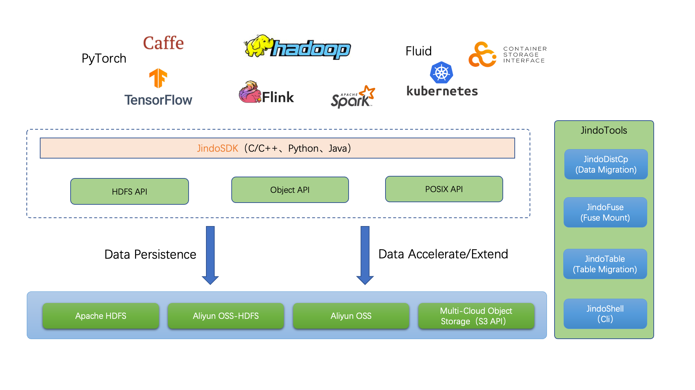

# JindoData User Guide

JindoData is a self-developed data lake storage acceleration suite by Alibaba Cloud's Big Data team, designed for big data and AI ecosystems. It provides comprehensive access acceleration solutions for both Alibaba Cloud and major industry data lake storage systems.

Built on a unified architecture and kernel, JindoData supports access through the all-purpose SDK (JindoSDK) to OSS/OSS-HDFS. JindoSDK is compatible with HCFS interfaces, object storage interfaces, and POSIX interfaces, as well as supporting Python and TensorFlow, along with a full ecosystem of compatible tools (JindoCli, JindoFuse, JindoDistCp) and plugins.

## Downloading and Installing JindoSDK

JindoSDK serves as the standard client for accessing JindoData components. To install and verify it, refer to [JindoSDK Download](jindosdk/jindosdk_download.md) and [JindoSDK Quick Start](jindosdk/jindosdk_quickstart.md). For multi-platform support, consult [JindoSDK Multi-Platform Support](jindosdk/jindosdk_deployment_multi_platform.md).

## Upgrading JindoSDK

As an actively updated client providing continuous updates with new features and performance improvements for Alibaba Cloud EMR data lakes, we recommend users stay up-to-date with the latest JindoSDK version for ongoing support and optimal experience. A convenient script is available to assist in upgrading JindoSDK across your cluster; please refer to the [JindoSDK Upgrade Documentation](upgrade/emr2_upgrade_jindosdk.md).

## Usage Scenarios

### Using JindoSDK in Hadoop Ecosystem

See [Using JindoSDK in Hadoop Ecosystem](jindosdk/jindosdk_deployment_hadoop.md)

### Using JindoSDK in AI Ecosystem

See [Using JindoSDK in AI Ecosystem](jindosdk/jindosdk_deployment_ai.md)

### Using Jindo Python SDK

See [Jindo Python SDK Quick Start](jindosdk/python/pyjindo_quickstart.md)

### Using Jindo TensorFlow Connector

See [Using JindoTensorFlowConnector](jindosdk/tensorflow/jindosdk_on_tensorflow.md)

### Using JindoFuse

See [JindoFuse Quick Start](jindofuse/jindofuse_quickstart.md)

### Using Jindo Flink Sink

See [Using Jindo Flink Sink](jindosdk/flink/jindosdk_on_flink.md)

### Using JindoRuntime with Fluid

See [Overview of Using JindoRuntime with Fluid](fluid-jindoruntime/jindo_fluid_overview.md)

### Authentication Solutions for JindoData

See [Authentication in JindoData](jindoauth/jindoauth_emr-next_kerberos.md)

### Data Copy Tools - JindoDistCp

See [Quick Start for JindoDistCp](jindotools/jindodistcp_quickstart.md)

### Warehouse Migration Tool - JindoTable MoveTo

See [Using JindoTable MoveTo](jindotools/jindotable_moveto.md)

### Warehouse Tier Management Tool - JindoTable SetStorage

See [Using JindoTable SetStorage Class](jindotools/jindotable_set_storage_class.md)

### OSS-HDFS Service (JindoFS) Client Tools

See [OSS-HDFS Service (JindoFS) Client Tools Overview](jindofs/jindofs_client_tools.md)

## FAQs

Refer to the [JindoData FAQs](faq.md)

## Release History

Check out the [JindoSDK Release Notes](releases.md) for version information.