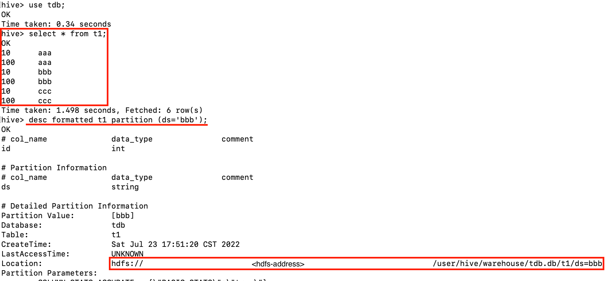

# Using JindoTable to Migrate Hive Tables and Partitions to OSS/OSS-HDFS

Due to limitations in scale and cost, HDFS may reach capacity bottlenecks. Cloud providers' offerings such as OSS/OSS-HDFS can serve as alternatives or supplements to expand the storage capabilities of cloud-based Hadoop platforms.

This tool facilitates moving Hive table data based on partition key rules between HDFS and OSS/OSS-HDFS.

# Prerequisites

## Deployed JindoSDK

- In an EMR environment, JindoSDK is pre-installed. Note:
    - To access OSS-HDFS, create an EMR cluster with version EMR-3.42.0 or higher or EMR-5.8.0 or higher.

- In non-EMR environments, first deploy JindoSDK. Follow the instructions in [Deploying JindoSDK in a Hadoop Environment](../jindosdk/jindosdk_deployment_hadoop.md).
    - For OSS-HDFS access, deploy JindoSDK version 4.x or higher.

## Deployed Hadoop and Hive Environments

- Ensure `hadoop classpath` returns valid results.
- Confirm that `$HIVE_HOME` and `$HIVE_CONF_DIR` environmental variables are correctly set.

## Configuring the Lock Directory for MoveTo Tool in HDFS

In your Hadoop configuration files (`core-site.xml` or `hdfs-site.xml`, either one works), add the configuration property: `jindotable.moveto.tablelock.base.dir`.

This value should point to an HDFS directory for storing lock files created automatically by the MoveTo tool during runtime. Ensure exclusive access to this directory by the MoveTo tool and proper permissions. If not specified, it defaults to `hdfs:///tmp/jindotable-lock/`, and an error occurs without proper permissions.

# Usage Instructions

## Getting Help Information

Execute the following command for help information:

```shell
jindotable -help moveTo
```

## Parameters Explained

```shell
jindotable -moveTo -t <dbName.tableName> -d <destination path> [-c "<condition>" | -fullTable] [-b/-before <before days>] [-p/-parallel <parallelism>] [-s/-storagePolicy <OSS storage policy>] [-o/-overWrite] [-r/-removeSource] [-skipTrash] [-e/-explain] [-q/-queue <yarn queue>] [-w/-workingDir <working directory>] [-l/-logDir <log directory>] [-iceberg]
```

| Parameter | Description | Required |
| --- | --- | --- |
| `-t <dbName.tableName>` | Table to move. | Yes |
| `-d <destination path>` | Destination path at the table level; partition paths will be created under this path automatically. | Yes |
| `-c "<condition>" / -fullTable` | Partition filter condition expression; supports basic operators but not UDFs. | No |
| `-b/before <before days>` | Only move partitions created before the given number of days. | No |
| `-p/-parallel <parallelism>` | Maximum task concurrency for the entire moveTo operation; default is 1. | No |
| `-s/-storagePolicy <OSS storage policy>` | Storage policy for data files when copied to OSS; options include Standard (default), IA, Archive, ColdArchive. | No |
| `-o/-overWrite` | Overwrite destination directory at partition level; does not overwrite partitions not involved in this move operation. | No |
| `-r/-removeSource` | Remove source paths after moving; if specified with `-skipTrash`, skips Trash. | No |
| `-skipTrash` | Skip Trash when removing source paths (if `-r` is specified). | No |
| `-e/-explain` | Explain mode; doesn't execute actual operation but prints partitions to be synced. | No |
| `-q/-queue <yarn queue>` | Specify YARN queue for distributed copy. | No |
| `-w/-workingDir` | Specify working directory for distributed copy. | No |
| `-iceberg` | Specify the migrated table is Iceberg; currently supports full table migration only and requires `-fullTable`. (Available from version 6.3.0+) | No |
| `-l/-logDir <log directory>` | Local log directory; defaults to `/tmp/<current user>/`. | No |

# Usage Example

1. Assume there's a Hive partitioned table in HDFS as shown below:

   

2. Want to move partitions `bbb` and `ccc` to OSS; first use explain mode (`-e` or `-explain`) to verify if the selected partitions meet expectations:

   

3. Remove `-e` to actually move partitions:

   

4. After completion, check data; it's now on OSS:

   

5. Try moving back to HDFS; operation fails because target directory isn't empty; use `-overWrite` to clear target directory:

   

6. Use `-overWrite` to force overwrite:

   

# Handling Exception States

To ensure data safety, this command automatically checks destination directories to prevent another command from concurrently copying data to the same location.
If conflicts are detected, the table or partition copy operation will fail.
In this case, manual intervention is required to confirm that no other command is copying data to the same destination.
Typically, this happens when the command is unexpectedly interrupted:
- Users manually kill the command process before it finishes.
- The process terminates abnormally due to memory overflow or similar exceptions.

If copying a table or partition fails with "Conflicts found," consider it an exceptional state requiring manual intervention.
At this point, data remains safe as both source data and table metadata remain unchanged.
There are two common scenarios for unexpected interruptions:
1. Users terminate the command before completion.
2. The process crashes due to an exception like out-of-memory.

When conflicts occur during table or partition copying, manual handling is necessary.

# Resolution Method

- Ensure no other command is copying data to the same target path, especially no DistCp/JindoDistCp jobs.
- Delete the destination directory. For non-partitioned tables, delete the table-level directory. For partitioned tables, delete the conflicting partition-level directory. Do not delete the source directory.

## Causes

A conflict state might arise if the command terminates abnormally before completion. This typically means:
- Users manually stop the command process.
- The process aborts due to an exception like an out-of-memory issue.

When copying a table or partition fails with "Conflicts found," treat it as an exceptional state needing manual resolution.