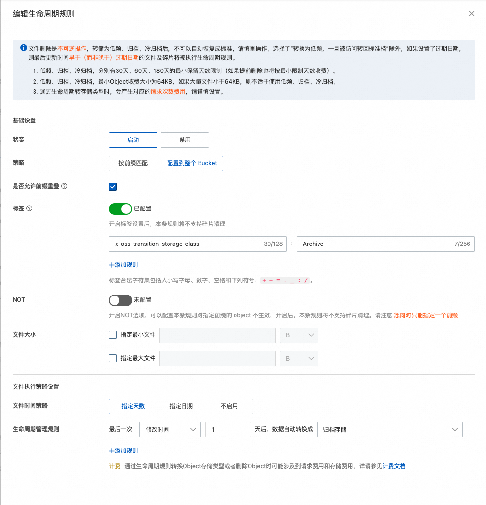

# 使用 JindoTable 将 Hive 表和分区数据进行归档


## 使用说明
该命令只支持标准 OSS 存储类型的转换， 不支持OSS-HDFS 存储类型转换，OSS-HDFS 存储类型转换参考[链接](https://help.aliyun.com/zh/oss/user-guide/enable-the-automatic-storage-tiering-feature-for-the-oss-hdfs-service)

## 配置OSS 生命周期
#### 配置低频生命周期规则


#### 配置归档生命周期规则



#### 配置冷归档生命周期规则


## 获取帮助信息

执行以下命令，获取帮助信息。

```
jindotable help -setStorageClass
```

## 参数说明

```shell
[-setStorageClass -t <dbName.tableName> -i/-a/-ca[-c "<condition>" | -fullTable] [-b/-before <before days>] [-p/-parallel <parallelism>] [-mr/-mapReduce] [-e/-explain] [-w/-workingDir <working directory>][-l/-logDir <log directory>]]
```

| 参数 | 描述 | 是否必选 |
| :--- | :--- | :--- |
| `-t <dbName.tableName>` | 要移动的表。 | 是|
| `-i/-a/-ca` | 指定存储类型，-i表示低频，-a表示归档 -ca表示冷归档。 | 是|
| `-c "<condition>" / -fullTable` | 分区过滤条件表达式，支持基本运算符，不支持udf。 | 否 |
| `-b/before <before days>` | 根据分区创建时间，创建时间超过给定天数的分区才进行移动。 | 否 |
| `-p/-parallel <parallelism>` | 整个moveTo任务的最大task并发度，默认为1。 | 否 |
| `-e/-explain`| 如果指定explain模式，不会触发实际操作，仅打印会同步的分区。 | 否 |
| `-w/-workingDir` | 指定分布式拷贝的工作临时目录。 | 否 |
| `-l/-logDir <log directory>` | 本地日志目录，默认为`/tmp/<current user>/` | 否 |

## 使用示例

```bash
jindotable  -setStorageClass -t data_center.test_partition -ca -c "date_id > '20240110'"
```

